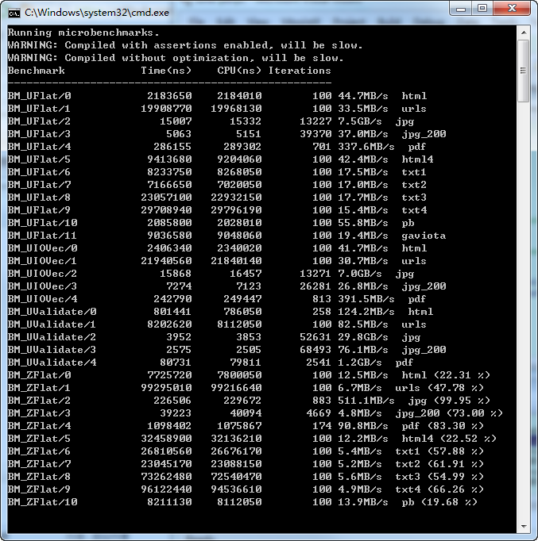

Snappy

谷歌2011年开始开发的一款专注于速度的压缩，解压库，速度完胜zlib。

百度的[sofa-pbrpc](https://github.com/baidu/sofa-pbrpc)也使用到了。

Snappy v1.1.7, August 24th 2017:

  * Improved CMake build support for 64-bit Linux distributions.

  * MSVC builds now use MSVC-specific intrinsics that map to clzll.

  * ARM64 (AArch64) builds use the code paths optimized for 64-bit processors.

---

最简单用法：

snappy::Compress(input.data(), input.size(), &output);

snappy::Uncompress(input.data(), input.size(), &output);

where "input" and "output" are both instances of std::string.

---
This Is A Debug Test!!!

